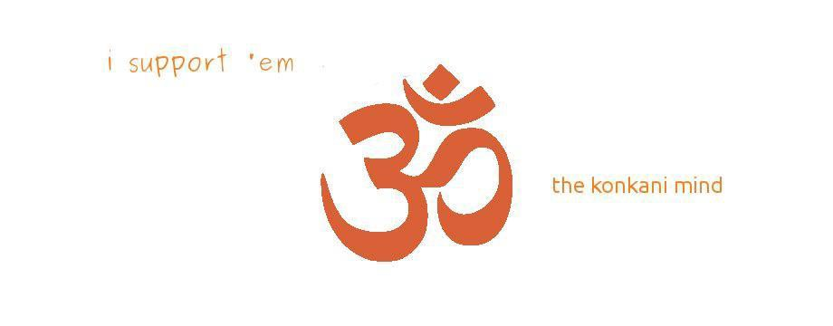
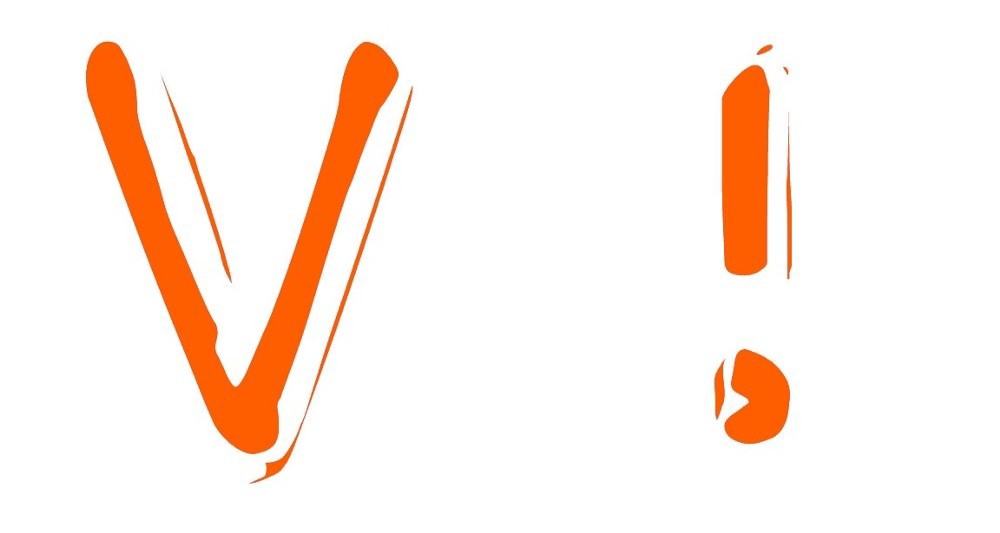

V! loves community, that is why V! want to give you BEAR hugs.

While that may sound childish and not possibly possible right now, unless you live close by, we can still give you the latest and the greatest about our adventures through the jungles of life at a newborn ‘company’.

To tell you honestly, while **V!** is still too young, this is not the first ‘company’ that I have started. Yes, It is the first one to have successfully completed 125 days of life! but not my first experience in running a company. Having been a **‘Student Entrepreneur’** for the past 5–6 years, it is but with pleasure that I take up new projects these days. Some of my past projects have been very diverse and they never reached the stage of being registered with any authorities.

While V! is still going through this stage, it is so emotionally pleasing to go back into the very corners of my life and notice that till date I have lived a very modern life, building companies, toppling them, rebuilding them, more and more. Though children of my age at that stage of life would have been found building with **LEGO** blocks and playing **Monopoly**, I was playing with the real thing, just as a glimpse here are some of my older **‘Companies’**

**Club Konkan** : this, though technically nothing more than a club, with some close friends as members, was my first group, a non-profit to encourage use of the _Konkani_ Language, and to propagate it. We used to do a lot of campaigning on Facebook.

I started by creating Facebook _Cover Photos_ and shared it all around, shared news on the latest around the web, anything that had to do with ‘_Konkani_’ism, the language I was most proud of using, a lot. What you see here is the cover photo I put up on my Facebook _Profile, in the year 2011_

**Kon.Kan** : Just about when **ICANN** released the proposal to make new g_TLDs_ I couldn’t possibly have keep shut, socially. Thus came to be born from a post on Facebook, this.

I wanted people from the _Konkani Sabha(society)_ to support me, and to bring about a new g_TLD_ that said _‘.KON’,_ Literally meaning ‘Who are you?’ in _Konkani._ Brilliant or not, I don’t know but, like Club Konkan, it went sink’n.

**V! mag :** On a fine August morning in 2014, I felt ‘Why not?’, yeah I totally did. That is when I jumped out of bed, took care of my routines and went _head-on_ to school, when I met my _‘Faithful Classmates’_, I jumped and proposed, wait!

I only informed them of this small plan of mine to start a magazine. They were not too thrilled, after-all I had pulled so many pranks on them, but then we negotiated between ourselves a lot. We finally pulled it off together, bit by bit, we reached Dday and so on _Diwali_ (2014) my first successful venture till date, was given the green flag. It was to be an always ‘free’ place to share your voice freely, with few restrictions, it did succeed in getting 10 posts, mostly by me, posting on the latest in Tech, we plan to do more.

---

#### Update : 30:6:2017

Time has changed a lot of things. V!’s now no more and now **BEARly** is now Devdutt Shenoi’s online persona. Let’s see what’s changed.

[**BEARlySpeaking**](http://blog.devdutt.ga)** :** **BEARly** is an online Persona of [_Devdutt Shenoi_](http://devdutt.ga). **BEARly Speaking** is now being run as a personal coding only blog. Devdutt Shenoi speaks about the topics of _programming_ and _computers._ This is also the spot online where Devdutt will be uploading his articles regarding regular coding as he continues to speak on _AI_ and _Machine Learning_ @ [_devdutt.ml_](http://devdutt.ml)_._

[**_Dev./ML_**](http://devdutt.ml)**:** Devdutt speaks about what he is doing in the field of _Machine Learning._ He also talks what is needed to be done in making AI _safe._

[**BEARspeak**](http://medium.com/bearspeak)**:** We need to talk things human, like _politics_ and _belief_. Devdutt Shenoi is a _thinker_ and he _speaks his mind_ online in a blog format.
