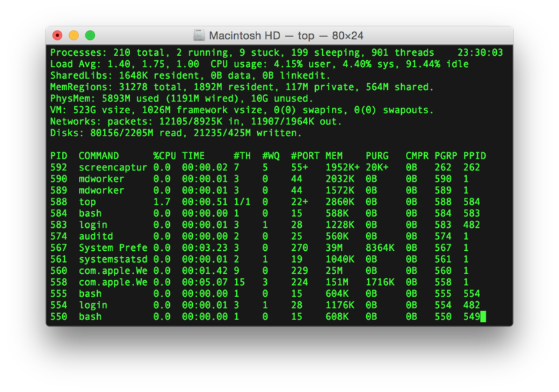
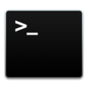
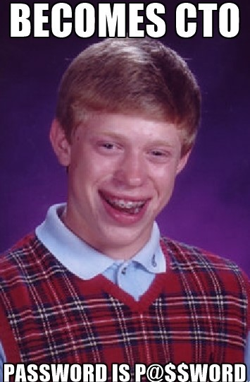

## ….the Command line is your wand and Algorithms your signature.

I thought that learning to program was easy, let me warn you in advance if you are the type who thinks so that [One does not simply learn to code](https://medium.freecodecamp.com/one-does-not-simply-learn-to-code-f25bacdc5b62).

> I thought that learning to program was easy.

Programming is a lot more than what one does with their mobile devices. If you are going to start a career with it, better begin with changing your mindset. Yes, remove all those misconceptions that have been filled into your brain by those **God-Made-Code-For-The-Blessed** NGOs and you shall be ready to dive into this magical world of computers.

Recently having started listening to a lot of podcasts about computers and code, let me point out that they miss out on the **_command line_**. Yes, the green and black **_‘ugly-face’_** is an important tool for any programmer and even most tutorials forget to use it completely. Did you know that there never was the need for separate **IDE**s for each and every programming language? All you need is a **_compiler_** plugged into your **_terminal_**.

If you want to feel like a **_hacker_** cracking into the Pentagon in no time, you are in the right place to begin learning the art of a **_code_**  **ninja**, get that? …because ninjas are trained to hack …with their swords (Sorry, that was not meant to be so lame).

---

#### Hell no, no Hello World

When you start to code, do it small but not like a shout-out, more like a calculation. I wrote code in **C++** to cheat on my [_physics experimental observation_](http://devdutt.ga/blog/articles/ac_sonometer.html). I saved some time with that and finally did something useful with my code, actually getting appreciated for the first time! Want to check that out? it is also uploaded to [_cpp.sh_](http://cpp.sh/94f3t).

You can make small web apps with such algorithms written in **JS** to start. It does help, knowing more algorithm than language, you get better at understanding computers than those who know how to code. In short you know what to code.

> Better to know what to code when others only know how to.

Yes, my friends at school did know programming, maybe some were struggling with their experimental observations as well, but I got to the code first! This is maybe why they have more emphasis on algorithms than language in school, the computer is the same, am I right? say **_‘_**_oui_**_’_** or **_‘_**_yes_**_’_** its all the same.

But sometimes I like to think that maybe the computer does only like some code, and I prefer others. The computer would most likely do just as I say and thus for me **JS** has ended up as my _recommended choice_ for any beginner. If you are just not the type interested in this magical sorcery of a _web-speak_, on the verge of taking over the world with [**_Robots and Drones and Virtual Realities and what not_**](http://peteroshaughnessy.com/posts/robots-vr-iot-cant-believe-its-javascript/)**_!_** You are not gonna be the best kinda reader for this piece.

---

#### For the sake of Locks & Keys

One thing that every _newbie_ should know is that the world of _coding_ is quite more complex than words that sound like gibberish.

You are a coder not only going to be making applications, but also simple things that appear to be invisible and then you know that they were the necessary functions that do your encryption and save you from **Pokemon go** users furious about losing their data or maybe even **North Korean** **_hackers_** with _nuclear codes_ or whatever those screens say are **_encrypted_** (You know who’s more dangerous).

You can forget to include cool stuff as long as you are sure you are not coding in security loop holes. You need to check code thoroughly for **_bugs_** and _loop-holes_ that will prove to be a pain in the rear when you reach the maintenance stage, unless you are selling some one a **_Hello World_** program (in which case give the poor guy some color in the program and maybe even a custom icon).

---

**_SEE YOU SOON WITH MORE_**
