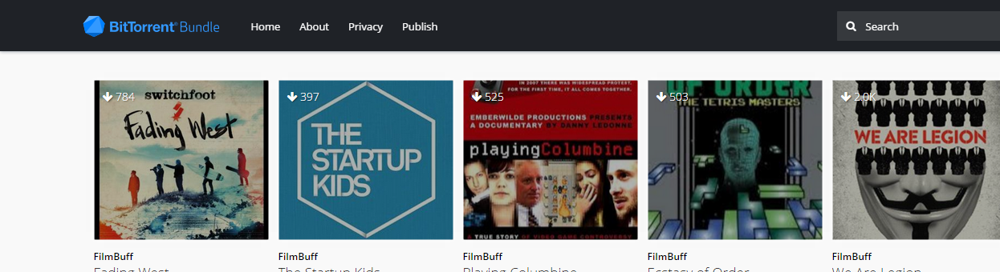

The problem with the Oscars, the Grammys and the other awards is that they tend to show films and album — that a person (our protagonist) thinks is not worth an award — in good light, thus a hint of curiosity does grow in the mind of the protagonist, doesn’t it, we all feel like watching a movie only when the critics give us a thumbs up, sometimes not too much, then again we all fall for it.

Many a times we make a go for it, and if you are not like me (a poor ‘kid of the internet’) you would be in a multiplex, enjoying an elaborated form of what could have just been compressed into a sentence, or sometimes more which is a very rare case. We could in fact say that Iron Man-in short- is nothing more than a very elongated form of saying that a man in steel armour, kicks some rather evil \*\*\*es, saves his girl, talks to his computer, flies defying nearly all scientific facts and then finally ‘saves’ the day, leaving us with none to enjoy for ourselves (sorry for the pun). Then there are some certain \*ahm\* sort of shapes that come on our faces when the film, we thought was sort-of worth it because it got the award at that ‘Oscar’, totally bored, and wasted some other wise precious time.

Neither there is much to talk about that guy, who sits in the corner of his flat, always wearing earphones, mesmerised by his laptop’s 14” display, always typing short word, maybe they are sentences. Yeah he must be torrenting, no he knows himself as ‘Jack’, definitely a pirate. We know it, don’t we, we all have done it, one day or the other we were browsing TPB, T.eu or the now infamous Kick\*\*\*.to, the coolest kid on the block.

Arr, didn’t you feel it the moment you clicked that magnet, maybe downloaded that torrent file. You know you did do torrenting one day, way back, sort of and then today, you might be looking back, feeling amazement at how you cheated the BigGuys and with the help of your loyal ‘accomplice’-the internet-you grabbed some old TV serial, maybe that latest One-Direction Track as well, but wasn’t that just what-you thought-laws allowed. Well till now I might have felt a bit like you Dad of Mom, but now let me get rid of those masks, ha I act sort of nice, right, but now let us change tracks.

### Back to the Future………………………………

Alright, Welcome to the future. Torrenting is not Illegal-sonny, I sould have said, Piracy is illegal and that is what the BigGuys wanted me to do-and you could download a lot of ‘Lossless’ (another pun) downloads that give you the amusement of a baby. Yeah, that is what parents must have done, totally the “Son download some new torrent” sort of thing. But since I have already made a small confusion in your mind, let me enlighten you more.

[Bittorrent](http://bittorrent.com), yeah the torrent app, it has a web repository of community published content, though usually the trial is free, you have to pay no ‘dear’ sums to get what Netflix would charge a $ more. But this is the age of the computers and you know everything can’t be free, they are just using your cash for transfer fees, at-the-least 1$ sums, but then you get some cool downloads, a movie that spans more than a whole hour in length.

I am in love with this kind of a market place. Pay what you want to, it is yours. [Bundles](http://bundles.bittorrent.com) is your best bet in getting good content, free, or for very cheap sums. See you on the other side soon, I am happy to note that many free websites also exist, an example is of ourselves, We don’t charge you for reading our article, neither for publishing your own with us. Just get your articles emailed to [our email](mailto:editor@vimag.vv.si).

Update: Bittorrent Bundles is now [NOW](http://now.bt.co)

›[Bundles](http://bundles.bittorrent.com) |[V!-mail](mailto:editor@vimag.vv.si)
