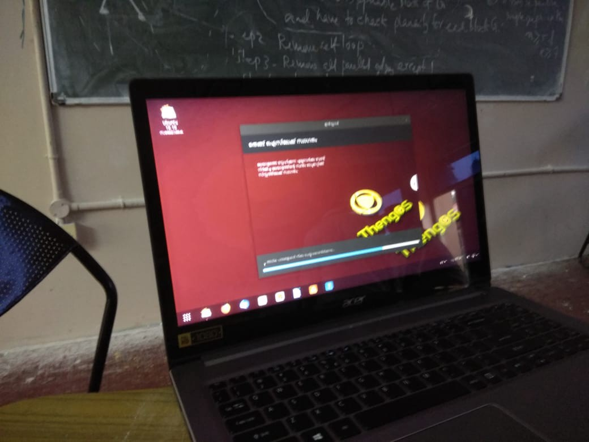
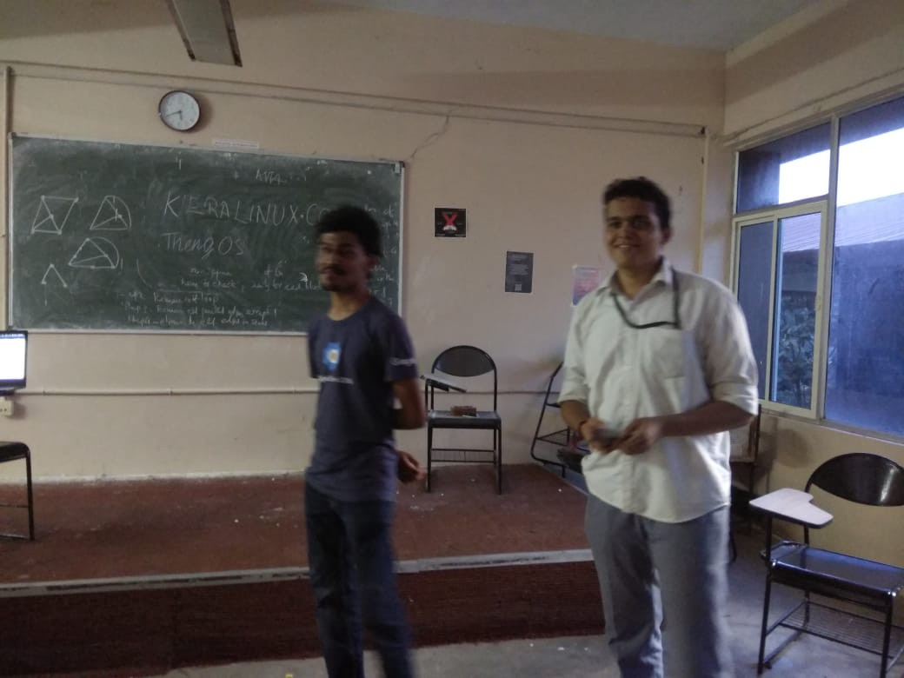
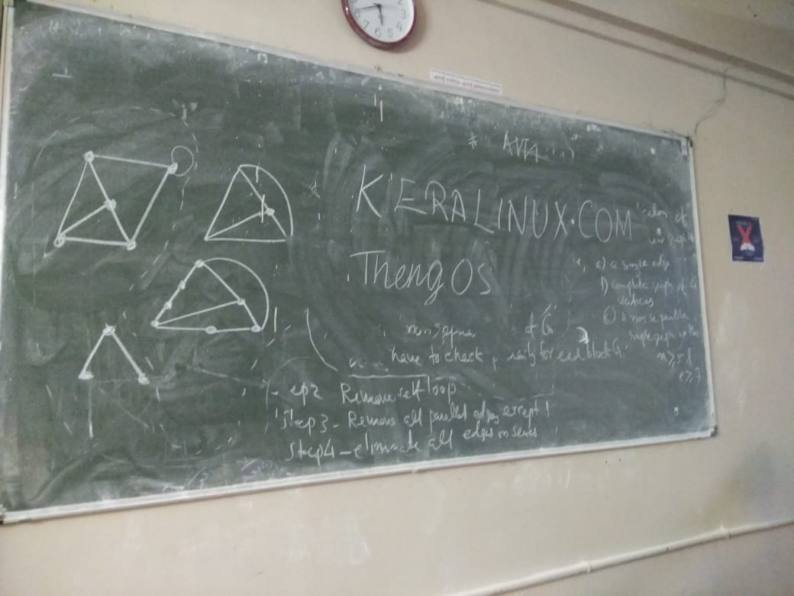
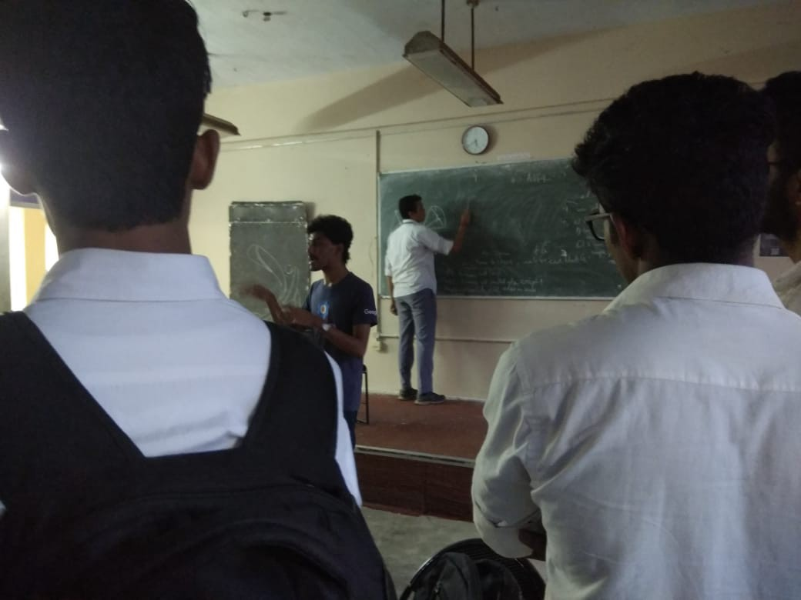

As it goes, everything cool, started somewhere unthought of.

In an auspicious turn of events, FOSSMEC was lucky to be a part of the launch party for [ThengOS](http://keralinux.com) which is a Linux distribution for the true malayalee.

#### _How did all of this come to be?_

Model Engineering College’s Technical festival [**Excel**](https://excelmec.org), conducted on _2, 3, 4_ November is launched a day prior to day 1, i.e. on 1st November, and as part of the same the finals of the premier competition for innovative and socially relevant ideas [**_‘iBeTo’_**](http://ibeto.excelmec.org) is conducted. [**_Subin Siby_**](https://subinsb.com) was a finalist selected from the _hackathon_ held in connection with the same [_#hackfortomorrow_](https://hackfortomorrow.excelmec.org). He also happens to be an ardent supporter of _FOSS_ and a personal friend of mine. Having been at the venue, the campus of **MEC**, he was curious about the activities of **_FOSSMEC_**, and as such requested me to introduce him with the who’s who here. Being the dude with them networking skills, I got down to work and in no time we had _Subin_ in contact with almost the whole of _FOSSMEC_, all that remained was something special, something to make his visit memorable to all of us.

#### _Releasing ThengOS, the FOSSMEC way!_

Being the 1st of November, also the birthday of the Kerala state, it was also the right time for _Keralites_ supporting _FOSS_ to get down to business and do something awesome. That awesomeness was found in the release of _ThengOS_, built with Ubuntu 18.10, but with Malayalam all over the _GUI_. This essentially solves the problem of those facing a language barrier as they don’t know English or any other language with much more support in the software. We were not sure as to how and even if the event would happen as there is always the issue of people being too busy and not being able to show up for something like the release of a little known community based project. This was fortunately not the case with _FOSSMEC_. Third years had an awesome show of strength, nearly everyone worth mentioning was there!

Add to all of that, what happened of course was a turning point in the history of **FOSSMEC**!
