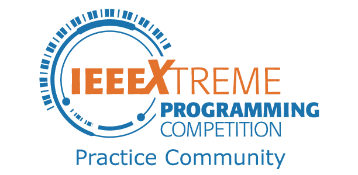

## Do you have what it takes to crack twisted puzzles and explain the solution to a computer?

The [IEEE-LINK](http://ieee-link.org) and [IEEE CS Kerala Section](http://cs.ieeekerala.org) is here again with a refreshed format of its IEEE Xtreme preparation series-PreXtreme. So what is this new addition to the online competitions circuit of LINK all about?

The [IEEE](http://ieee.org) has been conducting a world-wide 24 hour format programming competition to find the elite among programmers and this year we are in the 13th edition. Kerala Section has been a consistent source of young and enthusiastic participants from all over the state. [IEEE Xtreme](http://ieeextreme.org) is an interesting format of competitive programming and has become a platform for students to show their flare for cracking complex puzzles with rudimentary Data Structures and Algorithms.

This year we will be seeing the event take place in October-November as usual. Now, you might ask “Why start now? This is more than six months in the future!” and you will be right. But we have got a few things to make clear over here, starting with the fact that we are building a community of people passionate about competing. We are in it for the win and want to get the best of Kerala to make a mark on the World Wide Leader board!

This series will span a total of 6 months and have a few events associated with it. There will be regular blog posts and factoids about competitive coding and we will also have a set of coding competitions and P2P learning sessions arranged at the SB and Hub level before the actual IEEE Xtreme competition being hosted at nodal centers by the respective Hubs.

#### How do you start?

You can start now by contacting the Student Branch at your college. Yes, you have to be an IEEE member to participate and so we request you to join. You can get to know more about the IEEE by contacting the Student Branch at your SB. If that doesn’t work out, contact us at team@ieee-link.org and we will solve the issue for you :)

If you are an IEEE member already, just go ahead and read about how you can begin your journey in competitive programming. Also subscribe to us on [Facebook](http://facebook.com/ieeelink) and [instagram](http://instagram.com/ieeecsks) for the latest updates on the same!
